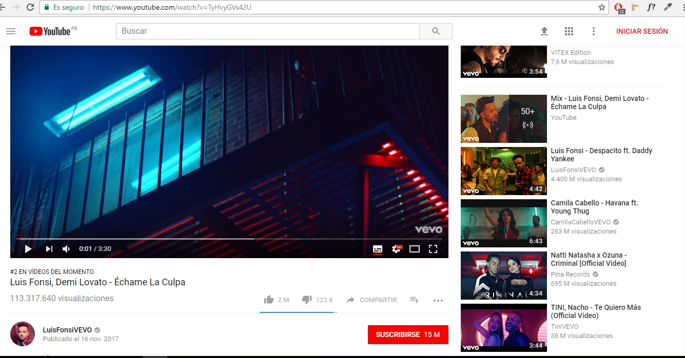
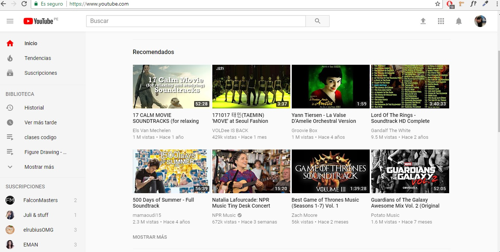

# Reto N° 1
## Objetivo

Explicar qué partes conforman el UX y qué partes el UI de una pagina web

## Youtube

UX

 * Poner pausa y seguir en los dispositivos que estes conectado
 * Poder buscar rapidamete dentro de los generos sugeridos.
 * Sugerencias basadas en el historia de reproducciones
 * La calidad cambia de acuerdo a la velocidad de conexión
 
 

 UX

 * Diseño de botones e iconos
 * Colores de la marca (rojo. blanco y gris)
 * Sub menu de reproducción con botones de like, dislike, share, add y more.
 * Sección de comentarios
 

